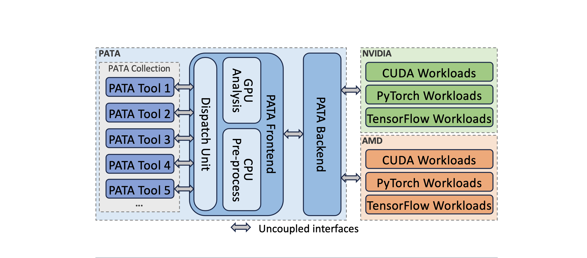

# Overview

AccelProf is a modular, extensible, and low-overhead framework for performance analysis across heterogeneous accelerators (e.g., NVIDIA GPUs, AMD GPUs). It provides unified profiling support for both low-level hardware events and high-level deep learning (DL) framework events, enabling comprehensive workload analysis.

  
<b>Figure 1:</b> Architecture of the PASTA Framework.

PASTA is composed of three decoupled components: the event handler, which interfaces with low-level profiling APIs and deep learning frameworks; the Processor, which performs pre-processing (either on CPU or GPU) and dispatches data; and the Tool Collection, which hosts user-defined analysis tools. This modular design enables extensibility and cross-vendor compatibility, allowing PASTA to support a wide range of workloads across NVIDIA and AMD platforms.

## Key Features

* Modular design with independent hander/processor/tool layers

* Cross-vendor support (NVIDIA, AMD)

* DL framework integration (PyTorch)

* Optional GPU-accelerated in-situ preprocessing

* Easy range-specific instrumentation using annotations

## Typical use cases

* Kernel frequency profiling

* UVM memory access optimization

* DL operator-level performance analysis

* And more...
